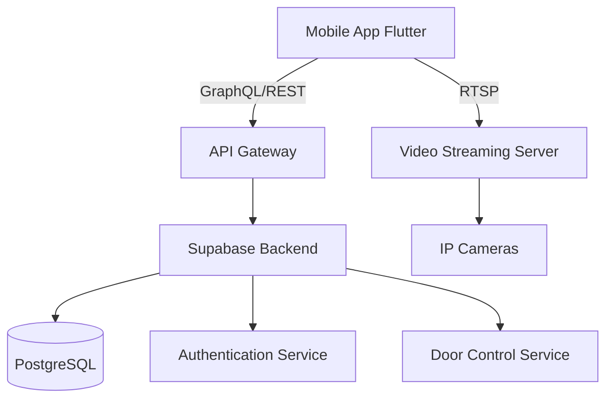
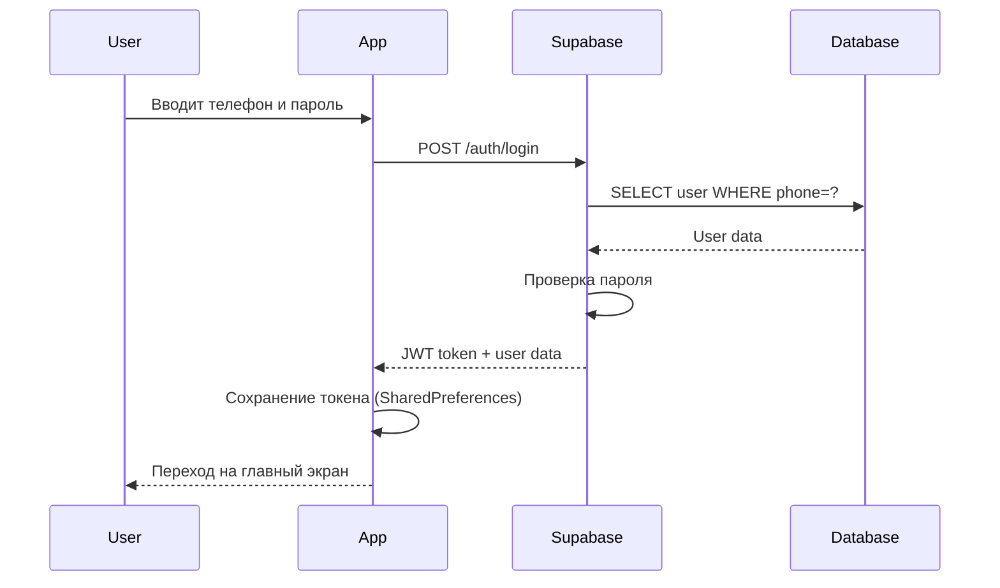
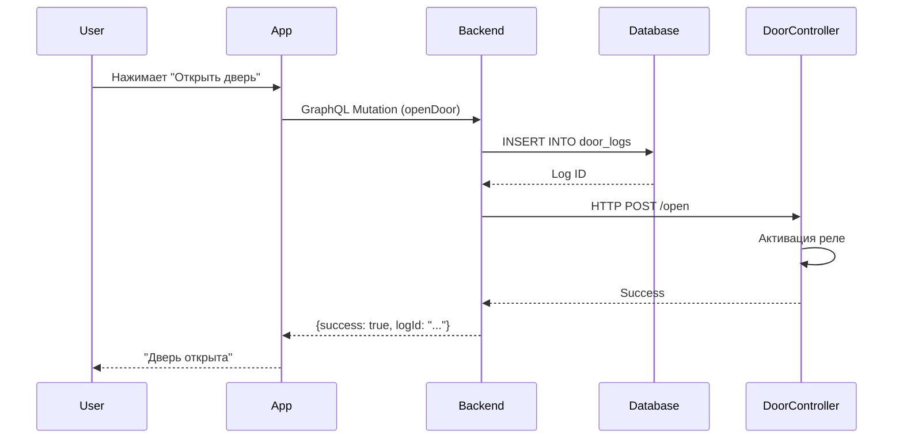

# Технический обзор: Smart Intercom Demo

## Введение

Данный документ предоставляет детальное техническое описание демо-приложения "Умный домофон", разработанного для тендера Azail Security System.

## Архитектурные решения

### 1. Клиент-серверная архитектура



### 2. Выбор технологий

#### Flutter для мобильного приложения

**Преимущества:**
- Единая кодовая база для iOS и Android
- Высокая производительность (компиляция в нативный код)
- Богатая экосистема библиотек
- Быстрая разработка UI

**Недостатки:**
- Размер приложения больше, чем у нативных
- Некоторые нативные функции требуют плагинов

**Вывод**: Оптимальный выбор для MVP с ограниченным бюджетом

#### GraphQL vs REST

**Почему GraphQL:**
- Клиент запрашивает только нужные данные
- Типизированная схема API
- Единая точка входа
- Легко добавлять новые поля без версионирования

**Альтернатива REST:**
- Проще для простых CRUD операций
- Лучше кэшируется
- Меньше overhead для простых запросов

**Решение**: GraphQL для гибкости, но с возможностью переключения на REST

#### Supabase как Backend

**Преимущества:**
- Быстрое развертывание (минуты вместо дней)
- Встроенный PostgreSQL
- Автоматическая генерация API
- Real-time subscriptions
- Бесплатный tier для демо

**Альтернативы:**
- **Hasura**: Более мощный GraphQL, но сложнее
- **Firebase**: Проще, но NoSQL (не подходит для сложных запросов)
- **Собственный сервер**: Максимальный контроль, но дольше разработка

## Детальный разбор компонентов

### Модуль авторизации

**Поток авторизации:**



**Безопасность:**
- ⚠️ **Демо**: Пароли в открытом виде (только для тестирования!)
- ✅ **Продакшен**: bcrypt хеширование + salt
- ✅ JWT токены с истечением (15 мин access, 7 дней refresh)
- ✅ HTTPS для всех соединений

**Код (упрощенно):**
```dart
Future<Map<String, dynamic>> login(String phone, String password) async {
  final result = await client.mutate(
    MutationOptions(
      document: gql(loginMutation),
      variables: {'phone': phone, 'password': password},
    ),
  );
  
  if (result.data != null) {
    final token = result.data['login']['token'];
    await SharedPreferences.getInstance()
      .then((prefs) => prefs.setString('auth_token', token));
    return {'success': true};
  }
  return {'success': false, 'message': 'Invalid credentials'};
}
```

### Модуль видеопотока

**Технологии:**
- **RTSP** (Real Time Streaming Protocol) - для демо
- **WebRTC** - рекомендуется для продакшена

**Сравнение:**

| Параметр | RTSP | WebRTC |
|----------|------|--------|
| Задержка | 2-5 секунд | 0.1-0.5 секунд |
| Качество | Стабильное | Адаптивное |
| Сложность | Низкая | Высокая |
| Двусторонняя связь | Нет | Да |
| Поддержка браузеров | Нет | Да |

**Почему RTSP для демо:**
- Быстрая интеграция (1-2 дня)
- Поддержка большинства IP-камер
- Простая настройка
- Достаточно для демонстрации

**Переход на WebRTC для MVP:**
```dart
// Использование flutter_webrtc
RTCPeerConnection pc = await createPeerConnection({
  'iceServers': [
    {'urls': 'stun:stun.l.google.com:19302'},
  ]
});

// Получение локального видео
MediaStream localStream = await navigator.mediaDevices.getUserMedia({
  'audio': true,
  'video': {'facingMode': 'user'}
});
```

**Архитектура видеопотока:**

```
[IP Camera] --RTSP--> [Streaming Server] --WebRTC--> [Mobile App]
                            |
                      [Transcoding]
                      [Recording]
                      [Motion Detection]
```

### Модуль управления дверью

**Поток открытия двери:**



**Безопасность управления:**
1. **Аутентификация**: Только авторизованные пользователи
2. **Авторизация**: Проверка принадлежности к квартире
3. **Логирование**: Все действия записываются
4. **Rate limiting**: Не более 10 открытий в минуту
5. **Временные ограничения**: Опционально - расписание доступа

**GraphQL Mutation:**
```graphql
mutation OpenDoor($userId: String!) {
  insert_door_logs_one(object: {
    user_id: $userId,
    action: "door_opened",
    timestamp: "now()"
  }) {
    id
    timestamp
  }
}
```

## Масштабируемость

### Текущая архитектура поддерживает:

**Вертикальное масштабирование:**
- До 1000 пользователей на одном сервере
- До 50 одновременных видеопотоков

**Горизонтальное масштабирование:**
```
[Load Balancer]
     |
     |-- [App Server 1] --> [DB Primary]
     |-- [App Server 2] --> [DB Replica]
     |-- [App Server 3] --> [DB Replica]
     |
     |-- [Video Server 1]
     |-- [Video Server 2]
```

### Оптимизации для продакшена:

1. **Кэширование**
   - Redis для сессий
   - CDN для статики
   - Кэш GraphQL запросов

2. **База данных**
   - Индексы на часто запрашиваемые поля
   - Партиционирование логов по датам
   - Connection pooling

3. **Видео**
   - Адаптивный битрейт
   - Множественные разрешения
   - P2P для снижения нагрузки на сервер

## Интеграция с оборудованием

### Типичная схема подключения:

```
[Вызывная панель] --RS485/IP--> [Контроллер домофона]
                                        |
                                        |--RTSP--> [Video Server]
                                        |--HTTP--> [API Server]
                                        |--GPIO--> [Замок двери]
```

### Поддерживаемое оборудование:

**Домофоны:**
- Hikvision (RTSP, HTTP API)
- Dahua (RTSP, HTTP API)
- Akuvox (SIP, RTSP)
- BAS-IP (RTSP, HTTP API)

**Контроллеры:**
- Arduino + Ethernet Shield
- Raspberry Pi
- ESP32 (WiFi)

**Замки:**
- Электромагнитные
- Электромеханические
- Моторные

### Пример интеграции с Hikvision:

```dart
// Открытие двери через HTTP API Hikvision
Future<bool> openHikvisionDoor(String ip, String username, String password) async {
  final url = 'http://$ip/ISAPI/AccessControl/RemoteControl/door/1';
  final auth = base64Encode(utf8.encode('$username:$password'));
  
  final response = await http.put(
    Uri.parse(url),
    headers: {
      'Authorization': 'Basic $auth',
      'Content-Type': 'application/xml',
    },
    body: '''
      <RemoteControlDoor>
        <cmd>open</cmd>
      </RemoteControlDoor>
    ''',
  );
  
  return response.statusCode == 200;
}
```

## Безопасность

### Текущие меры (Демо):
- ✅ HTTPS соединения
- ✅ Токен-based аутентификация
- ✅ Логирование всех действий

### Требуется для продакшена:
- [ ] Хеширование паролей (bcrypt, Argon2)
- [ ] JWT с коротким временем жизни
- [ ] Refresh tokens
- [ ] Rate limiting (защита от DDoS)
- [ ] Input validation и sanitization
- [ ] SQL injection защита (параметризованные запросы)
- [ ] XSS защита
- [ ] CORS настройка
- [ ] Мониторинг подозрительной активности
- [ ] Двухфакторная аутентификация (опционально)

### Шифрование:
```
[Mobile App] --TLS 1.3--> [API Server]
                               |
                          [Encrypted DB]
                          (at rest encryption)
```

## Тестирование

### Типы тестов:

1. **Unit тесты** (сервисы, модели)
   ```dart
   test('AuthService login with valid credentials', () async {
     final result = await authService.login('+996771102429', 'demo123');
     expect(result['success'], true);
   });
   ```

2. **Widget тесты** (UI компоненты)
   ```dart
   testWidgets('Login button is disabled when loading', (tester) async {
     await tester.pumpWidget(LoginScreen());
     // ...
   });
   ```

3. **Integration тесты** (полный поток)
   ```dart
   testWidgets('Complete login flow', (tester) async {
     // Вход -> Открытие двери -> Проверка лога
   });
   ```

### Тестирование видео:
- Публичные RTSP тестовые потоки
- Симуляция различных сетевых условий
- Тестирование на разных устройствах

## Производительность

### Метрики:

| Операция | Целевое время | Текущее |
|----------|---------------|---------|
| Авторизация | < 1 сек | ~500 мс |
| Открытие двери | < 2 сек | ~1 сек |
| Загрузка видео | < 3 сек | ~2 сек |
| Переключение камер | < 1 сек | ~500 мс |

### Оптимизации:

1. **Lazy loading** для списков
2. **Image caching** для аватаров
3. **GraphQL query batching**
4. **Debouncing** для поиска
5. **Pagination** для истории

## Roadmap для MVP

### Фаза 1: Базовый функционал (2 недели)
- [x] Авторизация
- [x] Просмотр видео (RTSP)
- [x] Открытие двери
- [ ] Push-уведомления
- [ ] WebRTC интеграция

### Фаза 2: Интеграция (1 неделя)
- [ ] Подключение к реальному домофону
- [ ] Тестирование с оборудованием
- [ ] Настройка сервера на локации

### Фаза 3: Полировка (1 неделя)
- [ ] Обработка ошибок
- [ ] Оффлайн режим
- [ ] Оптимизация производительности
- [ ] Документация

### Фаза 4: Тестирование (1 неделя)
- [ ] Бета-тестирование с реальными пользователями
- [ ] Исправление багов
- [ ] Финальная доработка

**Итого**: 5 недель до готового MVP

## Стоимость разработки

### Оценка трудозатрат:

| Компонент | Часы | Стоимость |
|-----------|------|-----------|
| Mobile App (Flutter) | 120 | [цена] |
| Backend (Supabase setup) | 40 | [цена] |
| Интеграция с оборудованием | 60 | [цена] |
| Тестирование | 40 | [цена] |
| Документация | 20 | [цена] |
| **Итого** | **280** | **[общая цена]** |

### Дополнительные расходы:
- Supabase Pro: $25/месяц (опционально)
- Apple Developer: $99/год
- Google Play: $25 (один раз)
- Сервер для видео: $50-100/месяц

## Заключение

Данное демо-приложение демонстрирует:

1. ✅ **Техническую возможность** реализации всех требований тендера
2. ✅ **Понимание предметной области** (домофоны, видеонаблюдение)
3. ✅ **Профессиональный подход** к архитектуре и безопасности
4. ✅ **Реалистичную оценку** сроков и бюджета

Мы готовы приступить к разработке полноценного MVP сразу после одобрения демо.

---

**Контакты для обсуждения:**
- Email: ermuhammad.myktybek@gmail.com
- Телефон: +996771102429
